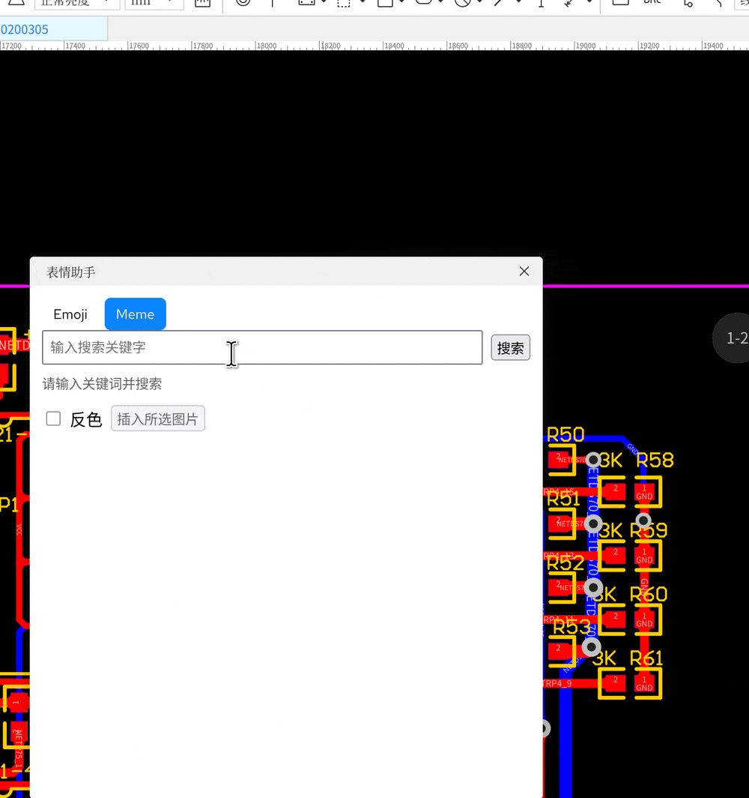
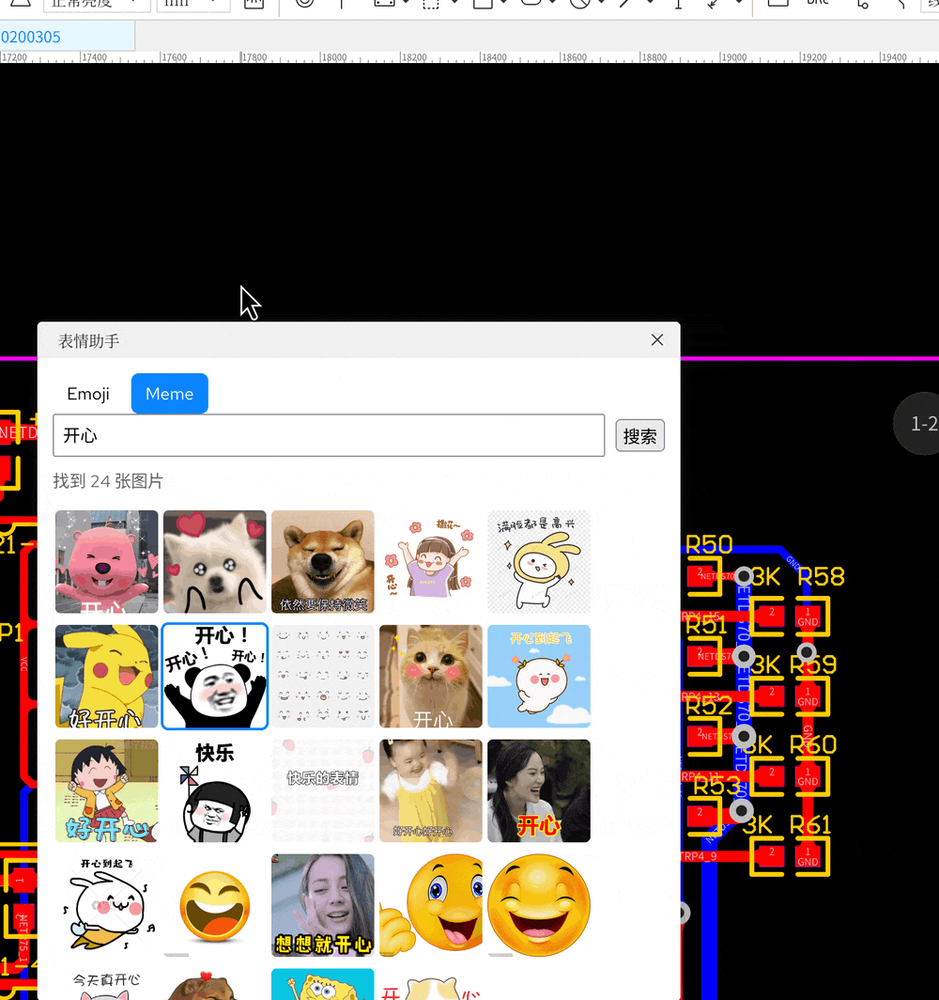

# meme_now

这是一个用于在嘉立创EDA的PCB丝印中插入表情包的插件工具。

## 功能介绍

该插件提供了如下功能

**插入表情包**

**插入emoj表情**

**插入彩色丝印**

## 使用方法

1. 导入插件后，在嘉立创EDA的PCB编辑器中，点击高级→表情助手→表情助手
2. 直接选择emoj表情或者点击meme标签，输入关键字搜索梗图，选择对应梗图
3. 点击插入所选图片，看到提示单击放置之后，在PCB合适位置上单击即可放置生成的丝印。

**注意** 1,当前梗图API调用频率有限制，如果一次获取不到，请稍等再试一次；2,如果插入丝印效果不佳，可以试试勾选反色。

## 开源许可

